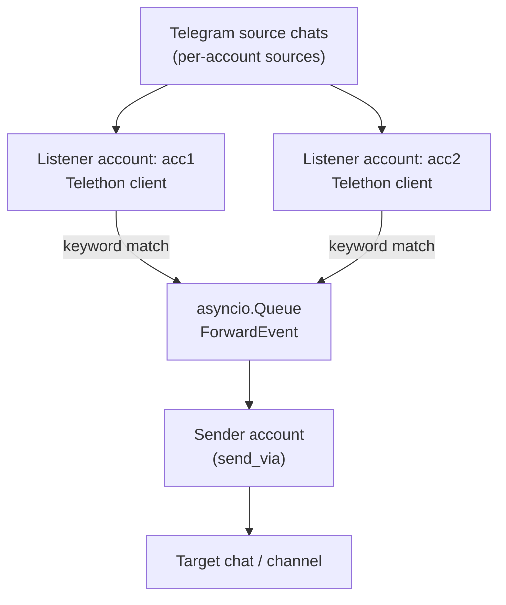

# tg-keyword-forwarder

A Telegram keyword-based forwarder built on **Telethon**.

The application listens to selected Telegram chats/groups using **multiple user accounts**, detects messages that match configured keywords or a regex, and forwards them into a target chat or channel using **one designated sender account**.

This design avoids Telegram session conflicts and allows monitoring chats that are accessible only from different accounts (e.g. due to bans or restrictions).

---

## Features

- Multiple listener accounts (Telegram **user sessions**, not bots)
- One sender account (`send_via`)
- Keyword matching (case-insensitive substring match)
- Optional regex matching
- Message forwarding with a link to the original message (when possible)
- File + console logging with rotation
- Designed for long-running background execution (systemd service)

---

## Architecture

### High-level flow


### Key ideas

- **One TelegramClient per account**
- Each listener:
  - listens only to its configured `sources`
  - pushes matched messages into a shared queue
- Exactly **one sender client**:
  - reads from the queue
  - forwards messages to `target.chat`
- Prevents `sqlite3 database is locked` errors
- Makes scaling to N accounts trivial

---

## Requirements

- Python **3.11+**
- Telegram API credentials:
  - `TG_API_ID`
  - `TG_API_HASH`
- Telegram user accounts (Telethon sessions)
- Linux / macOS (tested on Ubuntu)

---

## Installation

```bash
python -m venv .venv
source .venv/bin/activate
pip install -r requirements/requirements.txt
```


## Configuration

### 1) `.env`

Create .env from the example:
```bash
cp .env.example .env
```

Example:
```
TG_API_ID=123456
TG_API_HASH=xxxxxxxxxxxxxxxxxxxxxxxxxxxxxxxx
CONFIG_PATH=config.yaml
LOG_LEVEL=INFO
```
### 2) `config.yaml`

Create the main configuration file:
```bash
cp config.example.yaml config.yaml
```

Example:
```
send_via: "acc1"   # account name used for sending messages

log:
  level: INFO

matcher:
  keywords: ["urgent", "error", "ошибка"]
  regex: null

target:
  chat: "@my_channel"   # channel username or chat id (-100...)

accounts:
  - name: "acc1"
    session: "sessions/acc1.session"
    sources:
      - "@chat_a"
      - "-1001111111111"

  - name: "acc2"
    session: "sessions/acc2.session"
    sources:
      - "@chat_b"
```
### Notes

* `send_via` must match one of `accounts[*].name`

* The sender account must have permission to post to `target.chat`

* Each account must use a unique session file

* `sources` can be usernames or numeric chat IDs

## Logging in accounts (creating sessions)

Sessions are stored in `sessions/*.session` and must not be committed.

Create the directory:
```bash
mkdir -p sessions
```

Log in each account once using QR login (2FA supported):
```bash
source .venv/bin/activate

python -u src/login_session.py sessions/acc1.session
python -u src/login_session.py sessions/acc2.session
```

The script will:

* print a `tg://login?token=...` URL

* you must open it in Telegram (desktop or mobile)

* if 2FA is enabled, you will be prompted for the password

Re-running the script should show `Already authorized`.

## Running manually (foreground)
```bash
source .venv/bin/activate
PYTHONPATH=src python -u -m tg_forwarder.app
```

### Logs:

* Console output

* File: `logs/tg_forwarder.log` (rotated)

## Running as a background service (systemd)

A template service file is provided.

### 1) Install the service
```bash
mkdir -p ~/.config/systemd/user
cp deploy/systemd/tg-forwarder.service ~/.config/systemd/user/
```

Edit the file and replace all paths with absolute ones:

* `WorkingDirectory`
* `EnvironmentFile`
* `ExecStart`

### 2) Enable and start
```bash
systemctl --user daemon-reload
systemctl --user enable --now tg-forwarder.service
```

Check status:
```bash
systemctl --user status tg-forwarder.service
```

View logs:
```bash
journalctl --user -u tg-forwarder.service -f
```

To allow the service to run without an active login session:
```bash
loginctl enable-linger $USER
```

## Common issues
`sqlite3.OperationalError: database is locked`

#### Cause:

* Same .session file used by more than one TelegramClient
* Application started twice

#### Fix:

* One account → one session file
* Only one running instance

#### No link to original message

Links are generated as:

* `https://t.me/<username>/<msg_id>` for public chats
* `https://t.me/c/<internal_id>/<msg_id>` for private supergroups

Some private chats may not support clickable links.

## Security notes

Do not commit:

* `.env`
* `sessions/*.session`
* `logs/`

Session files grant full account access

Treat `TG_API_HASH` as a secret

## License

Internal / personal use.
No warranty. Use at your own risk.


